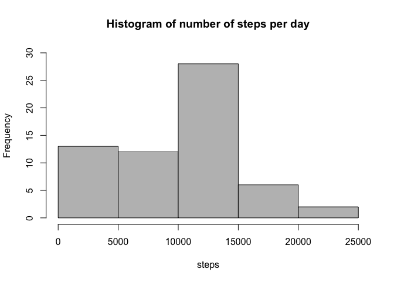
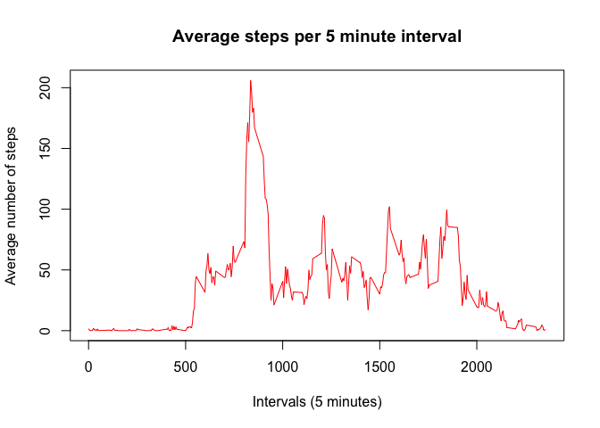
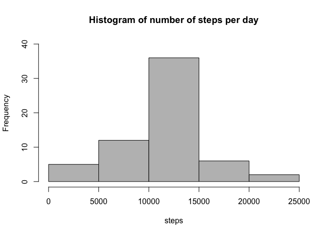
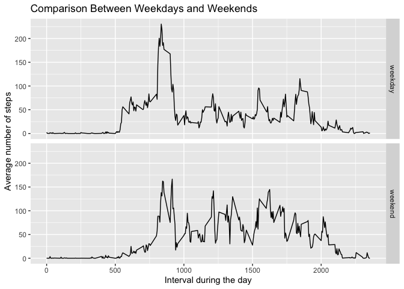

## Introduction

It is now possible to collect a large amount of data about personal movement using activity monitoring devices such as a Fitbit, Nike Fuelband, or Jawbone Up. These type of devices are part of the “quantified self” movement – a group of enthusiasts who take measurements about themselves regularly to improve their health, to find patterns in their behavior, or because they are tech geeks. But these data remain under-utilized both because the raw data are hard to obtain and there is a lack of statistical methods and software for processing and interpreting the data.

## Loading and preprocessing the data

We first start by making sure that the environment is clean and by loading the necessary packages.


```r
rm(list=ls(all=TRUE))	
library(dplyr)
```

```
## 
## Attaching package: 'dplyr'
```

```
## The following objects are masked from 'package:stats':
## 
##     filter, lag
```

```
## The following objects are masked from 'package:base':
## 
##     intersect, setdiff, setequal, union
```

```r
library(ggplot2)
```


Then we set the working directory to the folder you have the data and load the data with read.csv() function. Since we are going to work closely with the dates, it is convenient to transform the date variable into the date format.


```r
setwd("~/Documents/1st year/Econometrics/R/Reproducible Research")
data <- read.csv("./activity.csv", header=TRUE)
data$date <- as.Date(data$date)
```

## What is mean total number of steps taken per day?

1. Calculate the total number of steps taken per day

We do this by grouping the data by date and summing up the number of steps on that date.


```r
perday <- data %>% group_by(date) %>% summarize(stepsperday=sum(steps, na.rm=TRUE))
```

```
## `summarise()` ungrouping output (override with `.groups` argument)
```

```r
head(perday, 10)
```

```
## # A tibble: 10 x 2
##    date       stepsperday
##    <date>           <int>
##  1 2012-10-01           0
##  2 2012-10-02         126
##  3 2012-10-03       11352
##  4 2012-10-04       12116
##  5 2012-10-05       13294
##  6 2012-10-06       15420
##  7 2012-10-07       11015
##  8 2012-10-08           0
##  9 2012-10-09       12811
## 10 2012-10-10        9900
```

2. Make a histogram of the total number of steps taken each day


```r
hist(perday$stepsperday, main="Histogram of number of steps per day", 
      col="gray", xlab="steps", ylim=c(0,30))
```

<!-- -->

3. Calculate the mean and median of the total number of steps taken per day


```r
mean <- mean(perday$stepsperday)
median <- median(perday$stepsperday)
```

The mean number of steps taken per day is 9354.2295082 and the median is 10395

## What is the average daily activity pattern?

1. Make a time series plot 

We create a separate datset containing average number of steps per interval and then plot it.


```r
avgperint <- data %>% group_by(interval) %>% summarize(avg_steps=mean(steps, na.rm=TRUE))
```

```
## `summarise()` ungrouping output (override with `.groups` argument)
```

```r
head(avgperint, 10)
```

```
## # A tibble: 10 x 2
##    interval avg_steps
##       <int>     <dbl>
##  1        0    1.72  
##  2        5    0.340 
##  3       10    0.132 
##  4       15    0.151 
##  5       20    0.0755
##  6       25    2.09  
##  7       30    0.528 
##  8       35    0.868 
##  9       40    0     
## 10       45    1.47
```

```r
plot(avgperint$avg_steps ~ avgperint$interval, type="l", col="red", 
      xlab="Intervals (5 minutes)", ylab="Average number of steps", main="Average steps per 5 minute interval")
```

<!-- -->

2. 5-minute interval that contains the maximum number of steps


```r
max <- max(avgperint$avg_steps)
maxinterval <- avgperint[which(avgperint$avg_steps==max),]
maxinterval <- as.numeric(maxinterval[1])
```

The 5 minute interval that contains the maximum number of steps is 835 with the maximum average number of steps being 206.1698113.

## Imputing missing values

1. Calculate the total number of missing values


```r
totalna <- sum(is.na(data$steps))
```

There are 2304 missing values in the dataset.

2. Devise a strategy for imputing the missing values

In this exercise, we are going to imput the missing values with the mean number of steps taken for the corresponding interval. 

3. Create a new dataset with no missing values


```r
newdata <- data
i <- 1
while (i <= nrow(data)) {
    if (is.na(data$steps[i])) {
        newdata$steps[i] <- avgperint$avg_steps[newdata$interval[i]==avgperint$interval]
    }
  i=i+1
}
head(newdata, 10)
```

```
##        steps       date interval
## 1  1.7169811 2012-10-01        0
## 2  0.3396226 2012-10-01        5
## 3  0.1320755 2012-10-01       10
## 4  0.1509434 2012-10-01       15
## 5  0.0754717 2012-10-01       20
## 6  2.0943396 2012-10-01       25
## 7  0.5283019 2012-10-01       30
## 8  0.8679245 2012-10-01       35
## 9  0.0000000 2012-10-01       40
## 10 1.4716981 2012-10-01       45
```

I used a while loop which goes through the datset row by row to fill in the missing data with the mean value for the same interval if the data is missing. If not, nothing will change in the data for that row.

4. Plot a new histogram for the number of steps per day and calculate the new mean and median.


```r
newperday <- newdata %>% group_by(date) %>% summarize(stepsperday=sum(steps, na.rm=TRUE))
```

```
## `summarise()` ungrouping output (override with `.groups` argument)
```

```r
hist(newperday$stepsperday, main="Histogram of number of steps per day", 
     col="gray", xlab="steps", ylim=c(0,40))
```

<!-- -->


```r
newmean <- mean(newperday$stepsperday)
newmedian <- median(newperday$stepsperday)
```

The new mean number of the steps per day after imputing the missing values is 1.0766189\times 10^{4} and the new median is 1.0766189\times 10^{4}.

## Are there differences in activity patterns between weekdays and weekends?

1. Create a factor variable indicating weekday or weekend


```r
dayofweek <- newdata
dayofweek$date <- as.Date(dayofweek$date)
dayofweek$day <- ifelse(weekdays(dayofweek$date) %in% c("Saturday", "Sunday"), "weekend", "weekday")
dayofweek$day <- as.factor(dayofweek$day)

weekday <- filter(dayofweek, dayofweek$day == "weekday")
weekend <- filter(dayofweek, dayofweek$day == "weekend")

weekday <- weekday %>% group_by(interval) %>% summarize(avg_steps=mean(steps, na.rm=TRUE))
```

```
## `summarise()` ungrouping output (override with `.groups` argument)
```

```r
weekend <- weekend %>% group_by(interval) %>% summarize(avg_steps=mean(steps, na.rm=TRUE))
```

```
## `summarise()` ungrouping output (override with `.groups` argument)
```

```r
weekday$day <- "weekday"
weekend$day <- "weekend"

weekdaysdata <- rbind(weekday, weekend)
weekdaysdata$day <- as.factor(weekdaysdata$day)
```

2. Make a panel time series plot for weekdays and weekends


```r
g <- ggplot(weekdaysdata, aes (interval, avg_steps))
g + geom_line() + facet_grid (day~.) + 
  labs(y = "Average number of steps") + labs(x = "Interval during the day")+
  ggtitle("Comparison Between Weekdays and Weekends")
```

<!-- -->
